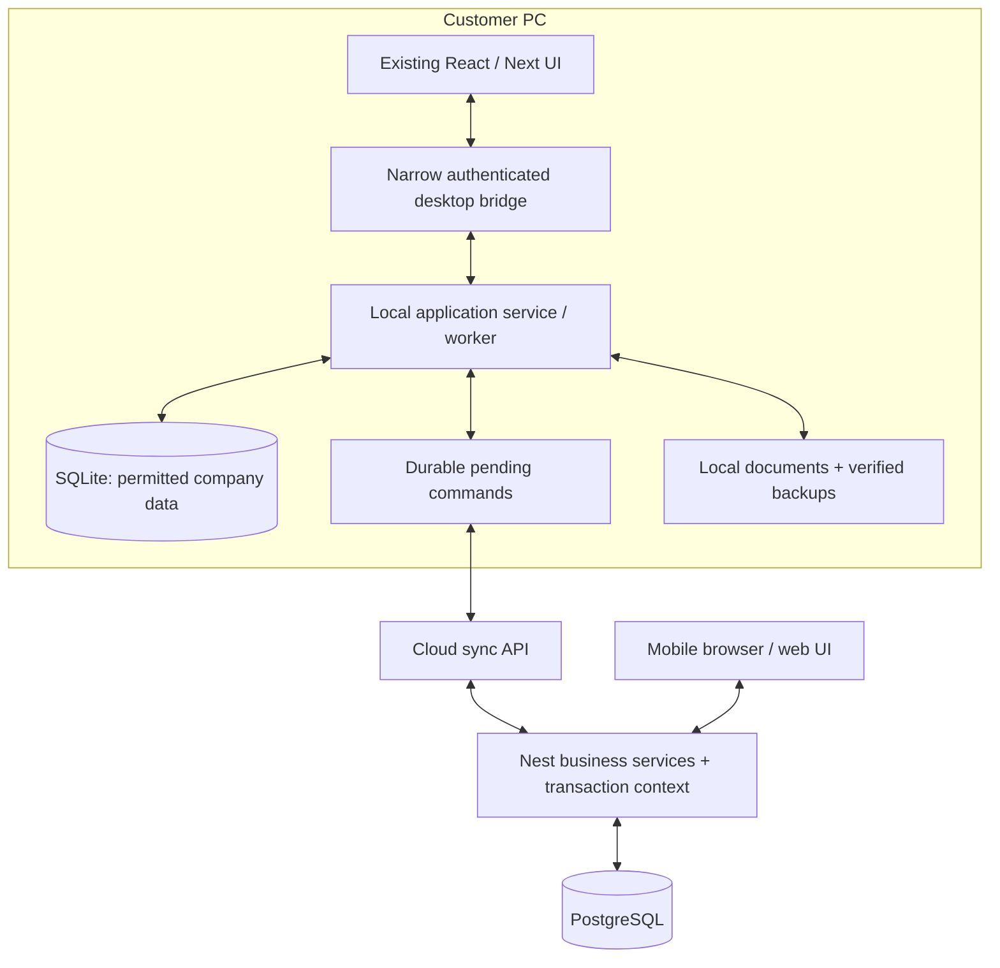

# Bizovix: নিরাপদ offline desktop ও cloud sync migration plan

Audit date: 2026-09-21. Repository: `D:\bizovix-contractor-erp`.

## বর্তমান ফলাফল ও সীমা

**এখন SQLite storage, desktop local service, account login এবং Categories, Units of Measurement, Payment Terms ও Organizations/Clients-এর offline save/cloud sync source-এ আছে। Organizations-সহ নতুন Windows preview installer তৈরি ও functional test করা হয়েছে। পুরো ERP SQLite-তে convert হয়নি। বর্তমান PostgreSQL application-ই default; desktop sync feature বন্ধ রাখা আছে। নতুন installer, পরীক্ষার প্রমাণ এবং release-এর বাকি কাজ [implementation status](implementation-status.md)-এ আছে।**

বর্তমান database-এর records, `.env` ও uploaded documents বদলানো হয়নি। নতুন cloud migration কেবল আলাদা test database-এ চালানো হয়েছে। পরীক্ষার জন্য বর্তমান local PostgreSQL থেকে read-only schema definition নেওয়া হয়েছে; customer records export করা হয়নি। Source-এ additive sync schema, category transaction integration এবং desktop runtime যোগ হয়েছে। পুরোনো PostgreSQL uninstall, data conversion বা production cutover করা হয়নি।

পরের ধাপে automatic verified backup, আগের password দিয়ে local data রেখে নতুন password-এ recovery, online grant renewal এবং account বদলালে পুরোনো request ভুল account-এ আবার submit হওয়া ঠেকানো হয়েছে। নতুন cloud database তৈরির default পরীক্ষা এখন source-derived baseline ব্যবহার করে; চালু database-এর schema পড়াও লাগে না। বাকি ERP module-এর offline conversion এখনও প্রয়োজন।

ব্যবহারকারীর নির্দেশ: data delete/loss হবে না; business/accounting logic অক্ষত থাকবে; customer শুধু install করে ব্যবহার করবে; offline data PC-তে থাকবে; internet এলে নিজের company/account-এর cloud data sync হবে; mobile থেকে permission অনুযায়ী দেখা যাবে। VPS deployment পরে হবে।

এই শর্তে এখনই global Prisma provider বদলানো নিরাপদ নয়। প্রথম audit-এ ১৭০ model, ৩৪৭ decimal field, PostgreSQL-specific locking ও replay-sensitive payment flow পাওয়া গেছে; master sync metadata যোগ হওয়ার পর বর্তমান cloud baseline-এ ১৭৮ table আছে। প্রথমে নীচের migration gates পূরণ করতে হবে। “কোনো DB issue হবে না” প্রমাণ ছাড়া বলা যাবে না; আমাদের release criteria হবে নির্দিষ্ট failure case-এ data ও হিসাব ঠিক থাকা।

## এই folder-এর নথি

| নথি | কী সিদ্ধান্ত/কাজ পাওয়া যাবে |
|---|---|
| [Implementation status](implementation-status.md) | বাস্তবে কী code হয়েছে, কোন tests পাস করেছে এবং full release-এর কী বাকি |
| [Database compatibility](database-compatibility.md) | Schema, exact amounts, SQL/locking, constraints, migration ও reconciliation |
| [Backup and account recovery](backup-and-account-recovery.md) | Automatic backup, password recovery, আলাদা directory-তে restore এবং পরীক্ষিত সীমা |
| [Fresh cloud database setup](cloud-database-bootstrap.md) | Existing database না বদলে নতুন server database তৈরি ও যাচাই |
| [Sync, auth and financial rules](sync-auth-and-financial-rules.md) | Tenant/user/device, offline login, retry, conflict, financial posting ও cloud contract |
| [Desktop runtime and installer](desktop-runtime-and-installer.md) | Packaging, ports, runtime, storage paths, installer, update ও performance checks |
| [Validation evidence](validation-evidence.md) | কোন পরীক্ষা হয়েছে, কী প্রমাণ করে, এবং কী পরীক্ষা হয়নি |
| [Machine-readable source inventory](source-inventory.json) | পুনরায় তৈরি করা যায় এমন field ও file/line inventory; কোনো customer data নেই |
| [API route coverage](route-coverage.json) | ৬৩১টি endpoint-এর module, permission, source file/line এবং local/cloud অবস্থান; বাকি port-এর সম্পূর্ণ route তালিকা |

## Product architecture



- PC-তে SQLite engine/runtime installer-এর মধ্যে থাকবে। Customer PostgreSQL/Node/pnpm install করবে না, `.env` লিখবে না, migration command চালাবে না।
- Cloud-এ current NestJS/PostgreSQL business platform থাকবে। Desktop বা mobile-এ cloud database password/signing secret দেওয়া হবে না।
- Local business logic ও cloud business logic একই domain rules ব্যবহার করবে; storage-specific operation আলাদা adapter/repository-তে থাকবে।
- First activation/bootstrap online। তারপর approved offline workflows স্থানীয়ভাবে চলবে। Internet ফিরলে app চালু থাকা অবস্থায় বা পরের launch-এ sync; always-running Windows service প্রথম release-এর প্রয়োজন নয়।
- Mobile v1-এ responsive authenticated web access: cloud-এ accepted/synced তথ্য দেখা। Desktop offline থাকলে এখনও unsynced তথ্য mobile-এ আসবে না।
- একাধিক PC-র আলাদা SQLite থাকবে; shared network folder/OneDrive-এর একটি live DB file সবাই খুলবে না।
- Multi-tenant ownership: company/organization → users → roles/permissions। যে user-এর যে data দেখার অধিকার নেই তা তার device-এ bootstrap/download করা হবে না।

## Source audit-এর সিদ্ধান্ত

| পাওয়া গেছে | কেন গুরুত্বপূর্ণ | সিদ্ধান্ত |
|---|---|---|
| 170 models, 102 enums, 69 SQL migration files | পুরো ERP-কে সরাসরি provider replacement করা বড় behavioral change | Domain অনুযায়ী port; cloud schema/default connection অক্ষত |
| 347 Decimal fields, scales 2/3/4/6; চারটি Decimal(24,6) | SQLite NUMERIC/REAL এবং int64 দিয়ে সব range একইভাবে রাখা যায় না | Exact decimal contract ও differential calculation tests আগে |
| PostgreSQL row locks, isolation levels, numbering SQL | SQLite-তে সেই concurrency semantics নেই | Local serialized writer + domain transaction adapter; cloud locks বজায় |
| Audit অনেক স্থানে mutation-এর পরে আলাদাভাবে লেখা | Audit log থেকে reliable sync তৈরি করা যাবে না | Domain change + audit + outbox/receipt একই transaction |
| কিছু financial endpoint প্রতি request-এ নতুন source ID তৈরি করে | Connection retry-তে একই টাকা দ্বিতীয়বার post হতে পারে | Persisted stable operation ID এবং atomic dedup receipt |
| Installer মূলত Next renderer প্যাক করে | বর্তমান installer zero-config offline ERP নয় | Local runtime, supported workflows, startup validation তারপর release |
| Auth এখন API/DB-dependent | Internet না থাকলে current login flow offline কাজ দেবে না | Signed expiring offline entitlement/session; cloud revalidation |

সুনির্দিষ্ট inventory read-only ভাবে পুনরায় চালাতে:

```powershell
node scripts/audit-offline-readiness.mjs
node scripts/audit-offline-readiness.mjs --json
```

## কোথায় কী পরিবর্তন হবে

নীচের table সম্পূর্ণ migration-এর নকশা। এর কিছু অংশ এখন implement হয়েছে; প্রত্যেকটির বর্তমান অবস্থা implementation status-এ আলাদা করে দেওয়া আছে।

| Area | Existing source | প্রস্তাবিত কাজ |
|---|---|---|
| Shared domain contracts | `packages/types`, `packages/validation` | Command DTO, exact decimal string, version, offline capability contracts; API compatibility বজায় |
| Domain services | `apps/api/src/modules/*/*.service.ts` | Module অনুযায়ী transaction context/repository injection; existing cloud interface বজায় |
| Local persistence | New `packages/desktop-storage` | SQLite schema, migrations, transaction unit, exact money storage, outbox, inbox/cursor, backup/restore |
| Shared business rules | New `packages/domain` | ধীরে pure validation/calculation extraction; DTO/rounding/lifecycle behavior এক রাখা |
| Local application service | New `apps/desktop/local-service` | Ported commands/queries, authenticated account context, background sync worker; renderer থেকে raw SQL নিষিদ্ধ |
| Cloud sync | `apps/api/src/modules/desktop-sync` | Device registration, bootstrap, push, pull, receipts, ordered feed, conflict response; বর্তমান scope Categories, Units, Payment Terms ও Organizations/Clients |
| Cloud schema | `packages/database/prisma/schema.prisma` + new additive migrations | Device binding, command receipt, change feed/cursor, domain versions; existing rows/IDs retain |
| Login/license | `auth`, `vendor-licensing`, `packages/api-client/src/token-storage.ts` | Cloud auth and offline grant পৃথক; account switching ও pending commands রক্ষা |
| Desktop startup | `apps/desktop/electron/src/main.ts`, `preload.ts` | Single instance, owned runtime, IPC allowlist, user-data paths, safe error recovery |
| UI transport | `packages/api-client/src/http-client.ts`, renderer `config/env.ts`, `AppProviders.tsx` | Explicit desktop transport, browser API behavior retain; stale/last-sync/pending/conflict UI |
| Documents | `documents/document-storage.service.ts` | Install folder-এর বাইরে account-scoped files, content hashes, resumable file transfer |
| Build/install | `electron-builder.yml`, `next.config.ts`, package scripts | Correct standalone layout, bundled dependencies, build-time vendor configuration, update/rollback |
| Verification | `apps/api/test-integration`, new desktop tests | Same business scenarios on old cloud behavior and local adapter; independent results comparison |

## Implementation-এর নির্দিষ্ট ক্রম

### Gate 0 — Baseline ও recovery

1. Worktree/source baseline এবং existing tests-এর pass/failure তালিকা সংরক্ষণ। বর্তমান DB-কে test runner-এর target হতে দেওয়া যাবে না।
2. Business schema-এর migration-only CHECK/unique/index rules inventory complete করা।
3. Production conversion-এর আগে PostgreSQL + documents-এর protected backup, অন্য database/directory-তে restore, row counts ও financial reconciliation। এই audit-এ এই backup/restore হয়নি।
4. বর্তমান operations থেকে regression fixtures: tender-to-close, procurement-to-payment, HR/payroll, LC/inventory, expenses/receipts, ledger/report। Existing real-service tests reuse করা।

Exit: Baseline reproducible; restore proof আছে; live data untouched।

### Gate 1 — Local storage ও runtime foundation

1. Actual packaged Electron runtime-এ selected SQLite driver পরীক্ষা; development Node probe দিয়ে production support ধরে নেওয়া যাবে না।
2. Per-environment/company/user storage boundary, migration ledger/checksums, WAL/foreign keys/busy handling এবং single-writer ownership।
3. Exact decimal abstraction: original precision/range/rounding preserve, no implicit `Number`/float conversion। Decimal(24,6) এবং aggregate overflow tests বাধ্যতামূলক।
4. Domain transaction + durable outbox; account/device binding; crash recovery; corrupt/newer schema fail closed without deleting the database।
5. Online snapshot backup, separate-directory restore verification; app update-এ pre-migration snapshot; fail হলে previous data intact।

Exit: Packaged runtime-এ storage tests pass; cloud/current ERP source behavior unaffected।

### Gate 2 — One complete workflow, including real sync

Pilot: Master Categories। এখানে monetary posting নেই, অথচ tenant, permissions, duplicate checks, edit/version conflict সব পরীক্ষা করা যায়।

1. Current service semantics অক্ষত রেখে supplied transaction + stable ID + version support।
2. Authenticated device registration ও offline grant; local category create/edit/list।
3. Local change এবং outbox atomic; cloud receipt + domain mutation + audit + change event atomic।
4. Two PCs, one isolated cloud database, mobile/browser cloud read—সম্পূর্ণ flow পরীক্ষা।
5. Disconnect before send, disconnect after server commit, repeat retry, simultaneous edit, permission revoke ও account switch tests।

Exit: Restart-এর পর entry থাকে; retry duplicate করে না; conflict input হারায় না; অন্য device accepted data পায়; অন্য tenant-এর data পায় না।

### Gate 3 — Domain-by-domain ERP port

| Workstream | Coverage | Release gate |
|---|---|---|
| Identity/settings/masters | Organizations, users/roles, parties, items/UOM/payment terms, numbering/config | Permission bootstrap, settings version, duplicate/name/collation parity |
| Tender workflow | Tender, costing, document purchase, security, credit commitment, PG/BG, sales quotations | Same lifecycle rules, amount/approval/numbering parity; monetary transitions financial gate-এ |
| Project/contract | CMS works, contracts, BOQ/budget, progress, variation/time extension | Contract/BOQ ceiling, closed-project restrictions, version conflicts |
| Procurement/inventory | PR, RFQ, quotation, comparison, PO, GRN, supplier bill/payment/ledger, LC | Quantity and stock reconciliation, no duplicate receiving/payment, exact landed cost |
| Finance | Cash/bank, expenses/general expenses, receipts, project bills, accounts/ledger, deductions/VAT/tax/challan | Balanced journals, account balances, stable posting IDs, immutable posted history/reversal |
| People/assets | HR, attendance/leave/payroll, fixed assets, depreciation | Existing approval rules, salary precision, repeated-run idempotency |
| Documents/closeout | Uploads/versions, certificates, retention/DLP/handover/closing | Files+metadata consistency, closed/archived readability, lifecycle parity |
| Cross-cutting/SaaS | Reports/dashboard, reminders/notifications, audit, support/billing/vendor licensing | Source-authoritative reporting, no duplicate jobs/notifications, entitlement and permissions |

কোনো module cloud-only থাকলে UI-তে সত্যভাবে online requirement দেখাবে। সব প্রয়োজনীয় workflow pass না হওয়া পর্যন্ত “পূর্ণ offline ERP” installer হিসেবে release হবে না।

### Gate 4 — Existing data transition

1. Signed-in user/company-এর অনুমোদিত snapshot; cloud auth secrets/password hashes/refresh tables/vendor-admin data local replica-তে নয়।
2. Data source থেকে read-only consistent export; schema/version manifest; original IDs, references, decimal strings, timestamps, arrays, JSON, document hashes রক্ষা।
3. Fresh staging SQLite file-এ import; কোনো existing usable DB file overwrite নয়।
4. Count + canonical field hash + orphan/constraint checks; balances, trial balance, receivables/payables, inventory and payroll totals compare।
5. Attachments verify; bootstrap cursor-এর consistent boundary নিশ্চিত।
6. সব validation pass হলে atomic activation of new local store; original PostgreSQL/data export intact থাকবে। Failure হলে usable previous path বজায়।
7. Cutover-এর পর pending local writes থাকলে rollback-এর আগে সেগুলো preserve/export/reconcile করতে হবে। পুরনো snapshot চালিয়ে নতুন entry হারানো যাবে না।

Exit: Per-company signed validation report; no lost records, references, money or files।

### Gate 5 — Install, update, mobile ও production launch

1. Fresh supported Windows VM-এ PostgreSQL/Node/pnpm ছাড়া installer পরীক্ষা।
2. First activation → offline save → reboot → reconnect → cloud accept → mobile view → second PC pull।
3. App update with data/pending commands; interrupted migration; reinstall/uninstall data retention; full restore drill।
4. Startup time, UI latency, memory, installer size এবং large-dataset behavior measured করা; target hardware-এ budget নির্ধারণ ও report করা।
5. VPS পরে provision হলে TLS domain, signing keys, backups, object/file storage, monitoring ও signed installer release। Production URL/keys customer-configured হবে না।

Exit: End-to-end release evidence; unsupported workflow zero বা explicitly agreed scope; no placeholder cloud config in installer।

## Data ও business behavior রক্ষার নিয়ম

- এই migration-এ `migrate reset`, business-data seed, truncate, destructive data cleanup বা global datasource replacement নয়।
- Existing PostgreSQL IDs/schema/history retain। Desktop আলাদা persistence target; production migration additive এবং independently reviewed।
- Cloud-এ raw client row upsert দিয়ে accounting/workflow bypass নয়। Allowed business command server আবার validate করবে।
- Retry-তে একবারের বেশি side effect নয়; operation receipt এবং side effects এক transaction-এ commit।
- Local pending input আলাদা preserve; cloud pull সেটি overwrite করবে না। Conflict/rejection হলে user-এর কাজ review করা যাবে।
- Posted financial entry blind last-write-wins নয়; reversal/adjustment এবং audit history preserve।
- Backups synchronization থেকে পৃথক; sync-এ deletion ছড়িয়ে পড়লেও protected backup দিয়ে recovery সম্ভব হতে হবে।
- Multiple disconnected PCs-এর balance/stock globally current বলা যাবে না। Conflict-sensitive finalization online acceptance/ownership policy অনুযায়ী হবে।
- New device/account activation মানে অন্য user-এর pending command দখল/পাঠানো নয়। Actor context audit-এ অক্ষত থাকবে।

## Offline policy: implementation-এর আগে product rules

Default design assumption: এক company-তে একাধিক user ও PC; mobile v1 মূলত cloud read; initial activation internet-dependent; offline financial work pending acceptance until safe finalization।

শেষ নকশায় লিখিতভাবে স্থির করতে হবে: offline entitlement কতদিন বৈধ, কোন approval/payment offline final হবে, sequential invoice numbers বাধ্যতামূলক কি না, conflict কে resolve করবে, initial supported Windows/CPU, backup retention এবং installation footprint/startup budget। এগুলো SQLite বেছে নিলেই স্বয়ংক্রিয়ভাবে নির্ধারিত হয় না।

## SQLite proof চালানো

```powershell
node scripts/probe-offline-sqlite.mjs
```

এই script শুধু fresh temporary database-এ six storage proofs চালায়: decimal-loss reproduction, exact arithmetic/range check, transaction rollback, duplicate/tenant FK, process-exit recovery এবং backup reopen। শেষে নিজের temporary files সরায়। `.env` বা ERP database পড়ে না।

এটি production storage implementation, full ERP integration test বা installer certification নয়। বর্তমান ফলাফল ও সীমা [validation-evidence.md](validation-evidence.md)-এ আছে।

## কেন এই পর্যায়ে default DB বদলানো হয়নি

User-visible setup-free software তৈরি করতে DB engine-এর সঙ্গে runtime, auth, account isolation, transaction rules, file storage, sync এবং updater একসঙ্গে প্রস্তুত হতে হবে। Audit-এ confirmed precision ও replay blockers আছে। সেগুলো ঠিক না করে default provider পরিবর্তন user-এর data/logic-preservation requirement-এর বিরোধী হবে। Storage/runtime এবং Categories, Units ও Payment Terms-এর offline workflow তৈরি হয়েছে; বাকি domain port ও release gates শেষ হওয়ার আগে full conversion বা customer release করা যাবে না।
